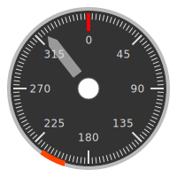

# Grafana Compass Rose Plugin

A compass/heading visualization panel for Grafana.

- Current heading with a gray pointer
- Degree markings every 3° with major marks at 45° intervals
- Optional "blind spot" range indicator in red-orange



## AI notice

This repository was created by Anthropic's Claude 3.5 Sonnet. Good job, Sonnet!

## Installation

### Docker Installation

```dockerfile
FROM ghcr.io/your-org/compass-rose:latest AS plugin
FROM grafana/grafana:latest

COPY --from=plugin /plugin /var/lib/grafana/plugins/compass-rose
ENV GF_PLUGINS_ALLOW_LOADING_UNSIGNED_PLUGINS=compass-rose
```

### Manual Installation

- Download the latest release
- Extract to your grafana plugins directory
- Restart Grafana

Enable the unsigned plugin by adding to grafana.ini:
```ini
[plugins]
allow_loading_unsigned_plugins = compass-rose
```

## Usage

- Add a new panel
- Select the Compass Rose visualization
- Configure three queries:

Query A: Heading value (0-360 degrees)
Query B: Blind spot start angle (optional)
Query C: Blind spot end angle (optional)

For Prometheus queries, use the Legend field to label your metrics

## Development

Install dependencies:
```
npm install
```

Build plugin:
```
npm run build
```

Build plugin in development mode:
```
npm run dev
```

### Test in Grafana

```
docker run -d \
  -p 3000:3000 \
  -v $(pwd)/dist:/var/lib/grafana/plugins/compass-rose \
  -e "GF_PLUGINS_ALLOW_LOADING_UNSIGNED_PLUGINS=compass-rose" \
  grafana/grafana
```
